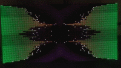

# go-rpi-fftwave



## What it is

This is a project for visualizing sound data on Raspberry Pi using LED screens with HUB75 connections and a soundcard.

The required software components are [FFTW3](http://www.fftw.org/), [rpi-rgb-led-matrix](https://github.com/hzeller/rpi-rgb-led-matrix) and portaudio libraries.

This is a rework of the [rpi-sound-c](https://github.com/TFK1410/rpi-sound-c) project. It worked fine on it's own but it was hard for me to maintain. I've used the dev branch of that repository for a while now but I figured it's time for a change.

This repository holds a rework written completely in Go. However it still uses some CGO snippets wherever necessary and it still uses the FFTW3 library as it is much faster than the internal FFT implementation in Go. 

Software includes:
* Display of FFT bins in logarithmic scale with color gradient starting from green at the bottom to red at the top
* White dot scale similar to those seen in Winamp spectrum display which will hold the temporary max value and after some time it will start to fall
* Background coloring based on the sound energy history creating color ripples
* Ability to add more ways of displaying the data and for it to be changed at runtime
* Implementation of a rotary encoder which is used to adjust the brightness of the display, switch the displayed pattern and toggle DMX coloring mode
* I2C communication with an Arduino Nano sidekick which reads incoming DMX data to change the display color via an external DMX sender

## Before running

The go get command will fail for the first time when pulling the necessary libraries. For how to get the Go bindings to work which should resolve those issues I'll refer to the [go-rpi-rgb-led-matrix](https://github.com/TFK1410/go-rpi-rgb-led-matrix) repo.

To be able to run the software next thing should be to also compile the FFTW library on Rasbperry Pi. I refer to the official website for more info on how to compile FFTW http://www.fftw.org/.

Next thing is setting up the default recording interface on the Rasberry Pi. Command like `arecord -l` should be helpful here as well as looking for the topic of blacklisting unneeded sound cards on the RPI.

One thing that also may recommend is isolating the last core from the four available on the RPI. This can improve the performance a little bit especially for the rpi-rgb-led-matrix library functions. This can be accomplished by adding `isolcpus=3 rcu_nocbs=3` at the end of /boot/cmdline.txt of the raspberry and then rebooting it. The isolation should be seen when looking at the content of the /proc/cmdline file:
```
$ cat /proc/cmdline
8250.nr_uarts=1 bcm2708_fb.fbwidth=656 bcm2708_fb.fbheight=416 bcm2708_fb.fbswap=1 vc_mem.mem_base=0x3ec00000 vc_mem.mem_size=0x40000000  dwc_otg.lpm_enable=0 console=ttyAMA0,115200 console=tty1 root=PARTUUID=e968d391-02 rootfstype=ext4 elevator=deadline fsck.repair=yes rootwait isolcpus=3 rcu_nocbs=3
```

## Configuration

An example configuration file with the descriptions on how to use those is provided at the root of this repo: config.yml. Please read through it to find some descriptions for the available options in the application. To use this configuration file use the -c/-config flag.

## Service file

The repository also includes a service file which can be deployed to run the application on boot using systemd.
```sh
sudo cp go-fft-display.service /lib/systemd/system/
sudo systemctl daemon-reload
sudo systemctl enable go-fft-display
sudo systemctl start go-fft-display
```

Change the service file accordingly if the configuration file is stored somewhere else

## Troubleshooting

If you are experiencing issues with PortAudio about it complaining: "cannot find card '0'" or something along those lines there are two things worth trying:
Add your user and maybe also the root user to the audio group
```sh
sudo usermod -a -G audio pi
sudo usermod -a -G audio root
```

Create a modprobe.d file to set the usb sound card at the first index:
```sh
$ cat /etc/modprobe.d/alsa-base.conf
options snd-usb-audio index=0
```

Also if you are at it it might be worth it to add your user to the gpio group as well. This would be used for the rotary encoder. No message will show up if this is causing some issues without being added to the group. The encoder just will not register.
```sh
sudo usermod -a -G gpio pi
sudo usermod -a -G gpio root
```

## Ansible installation playbooks

TODO